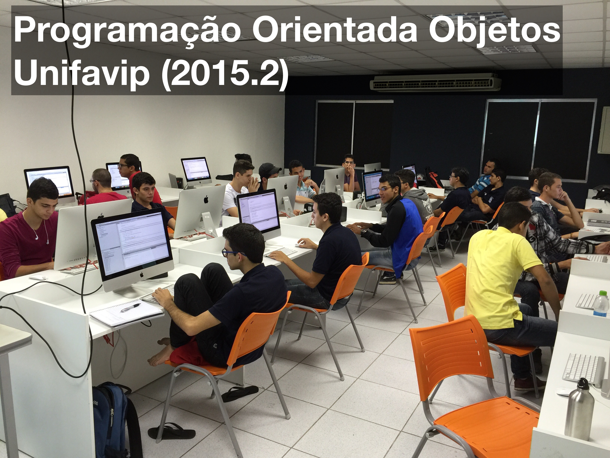
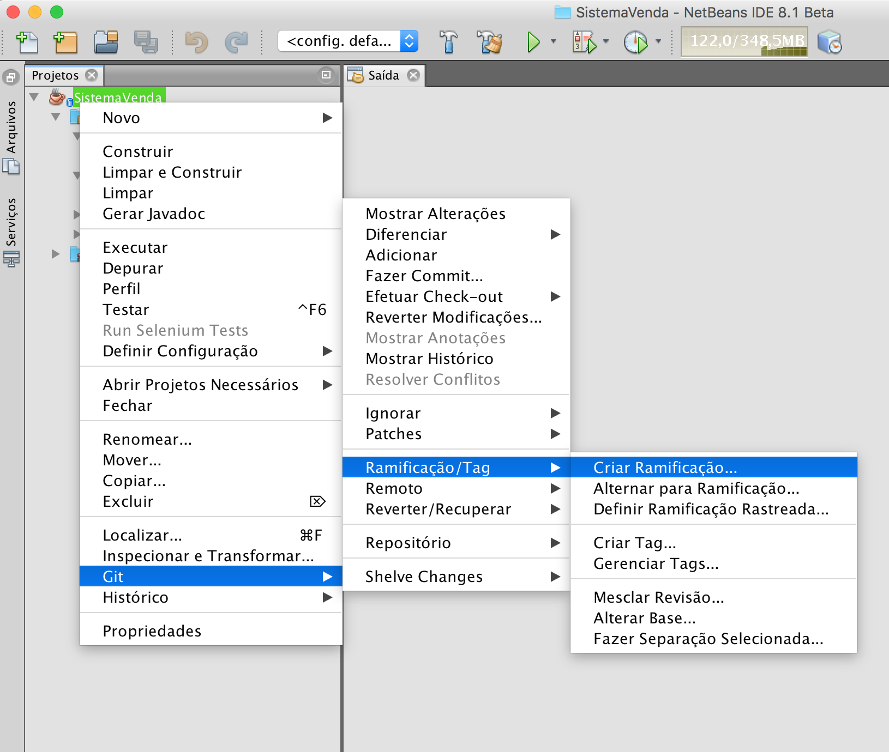
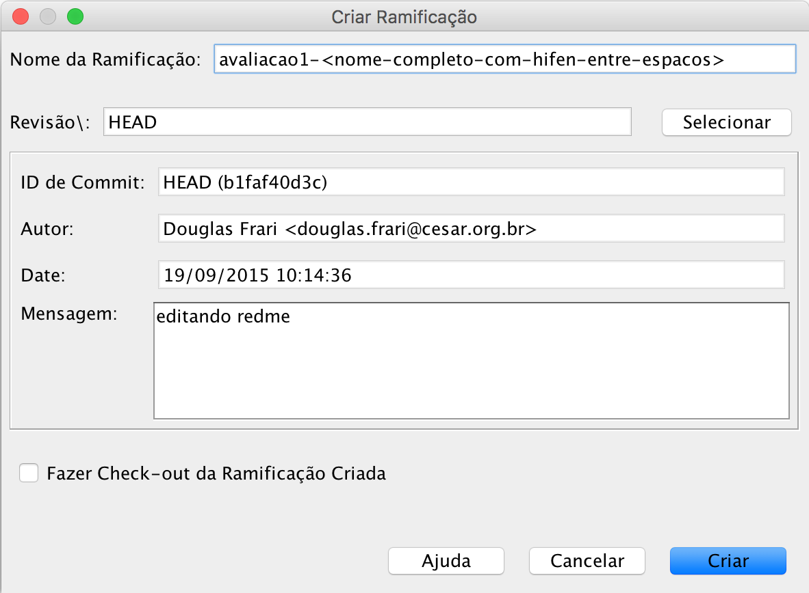
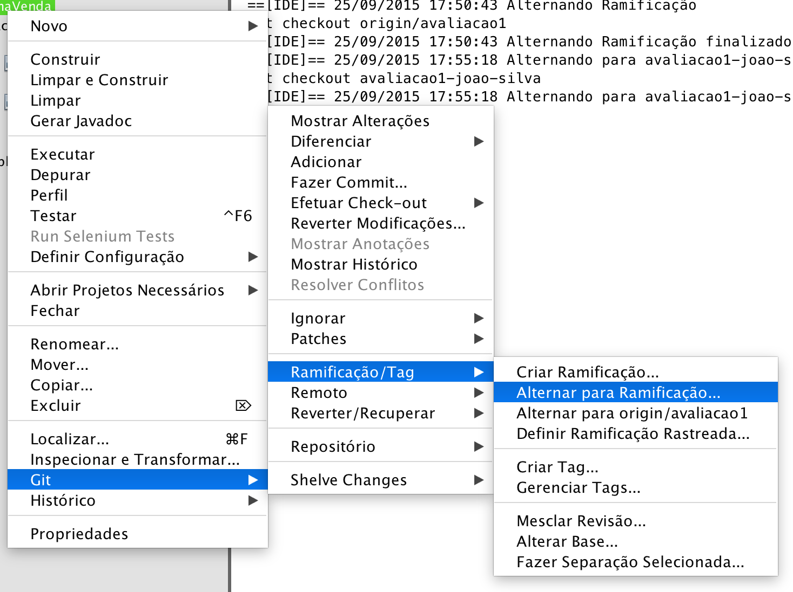

# poo-unifavip
Repositório de aulas da disciplina de Programação Orientada a Objetos (POO) - UNIFAVIP

##Turma:



## avaliação 1 (POO)

Inicialmente você precisa seguir as instruções do professor para baixar o projeto atual e criar um branch local para fazer a versão do seu projeto.

### Pré-requisitos

- Ter uma conta registrada no [Github](http://github.com "Github.com"); 
- Estar com o seu login registrado no repositório do professor [Douglas Frari](http://github.com/douglasddf/poo-unifavip	"Github POO Unifavip");
- Usar a IDE do Netbeans;
- Ter acesso a internet.


### 1: baixar o projeto

Baxar o projeto do seguinte site: 


> [github.com/douglasddf/poo-unifavip](http://github.com/douglasddf/poo-unifavip "Github.com")
 
O branch que deve ser baixado é:

```
avaliacao1
```
 
### 2: criar um branch pelo NetBeans

Após baixar o projeto **avaliacao1** você deve criar um branch clicando com o botão direito do mouse no projeto:

```
Git - Ramificação/Tag - Criar Ramificação
```
 


### 3: criando seu branch (ramificação)

No campo **Nome da Ramificação** você deve colocar o nome do seu  **branch** seguindo o seguinte padrão:



Coloque o nome do sua ramificação conforme o padrão sugerido abaixo:

```
avaliacao1-<nome-sobrenome>
```
Exemplo de nome da minha ramificação:

```
avaliacao1-douglas-frari
```

### 4: alternando a ramificação atual para o seu branch

Por fim, você precisa alternar o **branch** atual para a nova ramificação criada. Para isso siga os passos da imagem:



Basta clicar com o botão direito no seu projeto e seguir as opções:

```
Git - Ramificação/Tag - Alternar para Ramificação
```


